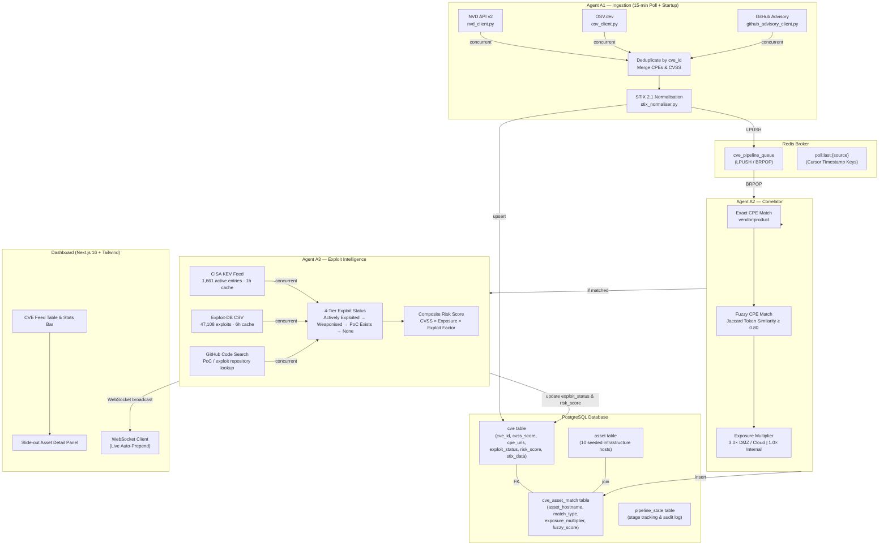

# AI-Powered Autonomous SOC Analyst Agent

> **B.Tech CS Major Project — KIET Group of Institutions, AY 2026–27**  
> Aligned with GOV-CS-018 Problem Statement (CERT-In / NTRO)

An autonomous multi-agent security operations system that ingests live CVE vulnerabilities, correlates them against infrastructure asset CPE inventories, pulls real-world exploit intelligence, calculates composite risk scores, and pushes real-time alerts to a SOC dashboard — **end-to-end in under 30 seconds**.

---

## 🌟 Architecture & Pipeline Orchestration



---

## ⚡ Core Capabilities (V1.0 Implemented)

### 1. Multi-Source Live CVE Ingestion (Agent A1)
- **NVD API v2 Poller (`nvd_client.py`)**: Performs incremental 24-hour window scans using NVD API key pagination with mandatory 6-second inter-page rate limiting.
- **OSV.dev Package Poller (`osv_client.py`)**: Package-scoped queries for open-source ecosystems matching seeded asset inventory.
- **GitHub Security Advisories (`github_advisory_client.py`)**: GraphQL API polling for real-time advisory ingest.
- **STIX 2.1 JSONB Normalisation (`stix_normaliser.py`)**: Normalises raw CVE JSON into STIX 2.1 bundles containing `Vulnerability` SDOs (using deterministic `uuid5(NAMESPACE, cve_id)`) and `Software` SCOs for all parsed CPE URIs.
- **Deduplication & Quality Guard**: Merges CVE data across sources prioritising NVD for CPE completeness. DB upserts ensure CVSS scores never regress (`ON CONFLICT DO UPDATE WHERE cvss_score IS NULL`).

### 2. CPE Asset Correlation Engine (Agent A2)
- **Exact CPE Matching (`cpe_utils.py`)**: Case-insensitive matching of `vendor:product` pairs between CVE CPE URIs and infrastructure asset inventories.
- **Fuzzy Matching Fallback**: Tokenized Jaccard similarity score metric ($J(A, B) = \frac{|A \cap B|}{|A \cup B|}$) triggered when exact matching yields no hit, matching with a confidence threshold $\ge 0.80$.
- **Environment Exposure Multiplier**:
  - **3.0×**: DMZ and Public Cloud assets (`is_internet_facing = true`).
  - **1.0×**: Internal network assets (`is_internet_facing = false`).
- **Pipeline Efficiency**: CVEs without asset correlation matches are marked `skipped` in `pipeline_state` and dropped from computationally expensive downstream exploit checks.

### 3. Real-World Exploit Intelligence & Risk Scoring (Agent A3)
- **CISA KEV Integration (`kev_client.py`)**: In-memory catalog of 1,661+ CISA Known Exploited Vulnerabilities with 1-hour automatic refresh.
- **Exploit-DB Catalog (`exploitdb_client.py`)**: Full offline search across 47,100+ exploits using 6-hour cached CSV data.
- **GitHub PoC Detection (`github_poc_client.py`)**: Live GitHub Code Search for public proof-of-concept repositories with recency evaluation.
- **4-Tier Exploit Status Classification**:
  | Exploit Tier | Condition | Exploit Factor | Pill Color |
  |---|---|---|---|
  | **Actively Exploited** | Listed in CISA KEV Catalog | **2.0×** | Red |
  | **Weaponised** | Verified / Remote hit in Exploit-DB | **1.5×** | Orange |
  | **PoC Exists** | Public Exploit-DB or GitHub PoC repo | **1.2×** | Yellow |
  | **None** | No public exploit found | **1.0×** | Slate |

- **Composite Risk Score Formula**:
  $$\text{Risk Score} = \text{CVSS Base Score} \times \text{Exposure Multiplier} \times \text{Exploit Factor}$$
  *(e.g., Log4Shell on Internet-Facing Server: $10.0 \times 3.0 \times 2.0 = \mathbf{60.0}$)*

### 4. Direct Single-CVE Manual Injection & SOC Triage (`POST /pipeline/inject/{cve_id}`)
- Enables SOC analysts to inject any specific historical or high-priority CVE (e.g., `CVE-2021-44228`) directly by ID.
- Fetches single-item NVD record without bulk rate limits or time-window constraints, immediately pushing to the Redis pipeline for sub-second correlation and scoring.

### 5. SOC Analyst Dashboard (Next.js 16)
- **Live Feed & WebSockets**: Connected to `WS /ws/cves` for real-time alerts without page reload.
- **Filtering & Stats**: Filter by exploit status (`Actively Exploited`, `Weaponised`, `PoC Exists`, `None`) and minimum CVSS score.
- **Slide-Out Asset Detail Panel**: Interactive panel displaying composite risk score breakdown, matched asset hostnames, IP addresses, zones, exposure multipliers, and reference links.

---

## 🎯 Verified Demo Run (R21 Log4Shell Checkpoint)

Injecting `CVE-2021-44228` (Log4Shell) via `POST /pipeline/inject/CVE-2021-44228`:

```json
{
  "cve_id": "CVE-2021-44228",
  "cvss_score": 10.0,
  "exploit_status": "Actively Exploited",
  "risk_score": 60.0,
  "matched_assets": [
    {
      "hostname": "app-server-01",
      "ip_address": "203.0.113.10",
      "zone": "dmz",
      "is_internet_facing": true,
      "match_type": "exact",
      "exposure_multiplier": 3.0
    }
  ]
}
```

- **Wall-Clock Processing Time**: **~5 seconds** (Injection to WebSocket Dashboard Broadcast).
- **Matched Asset**: `app-server-01` (DMZ, Internet-facing).
- **Exploit Status**: `Actively Exploited` (CISA KEV Listed).
- **Composite Risk Score**: **60.0** ($10.0 \times 3.0 \times 2.0$).

---

## 🛠️ Technology Stack

- **Backend**: Python 3.12, FastAPI, SQLAlchemy 2.0 (AsyncIO), Alembic, Pydantic v2, Structlog, APScheduler.
- **Data & Message Broker**: PostgreSQL 16 (JSONB STIX storage), Redis 7 (LPUSH/BRPOP queue & poll cursor tracking).
- **Frontend**: Next.js 16 (App Router & Turbopack), TypeScript, Tailwind CSS, Clerk Auth, WebSockets.
- **Containerization**: Docker & Docker Compose.

---

## 🚀 Quick Start Guide

### Prerequisites
- [Docker Desktop](https://www.docker.com/products/docker-desktop/) (running)
- [Node.js 20+](https://nodejs.org/) (optional for local frontend dev)

### 1. Clone & Configure Environment
```bash
git clone https://github.com/AkshatSharma-05/AI-Powered-Autonomous-SOC-Analyst-Agent.git
cd AI-Powered-Autonomous-SOC-Analyst-Agent

cp .env.example .env
cp frontend/.env.local.example frontend/.env.local
```

### 2. Start Infrastructure & Run Migrations
```bash
# Start PostgreSQL and Redis
docker compose up -d postgres redis

# Run Alembic Database Migrations (001 -> 002 V1.0 Schema)
docker compose run --rm backend alembic upgrade head

# Seed 10 Infrastructure Benchmark Assets
docker compose run --rm backend python scripts/seed_assets.py
```

### 3. Launch All Services
```bash
docker compose up -d
```

Check container status:
```bash
docker compose ps
```

### 4. Access System Interfaces
- **SOC Analyst Dashboard**: [http://localhost:3000/dashboard](http://localhost:3000/dashboard)
- **FastAPI OpenAPI Swagger Docs**: [http://localhost:8000/docs](http://localhost:8000/docs)
- **Backend Health Check**: [http://localhost:8000/health](http://localhost:8000/health)

---

## 📡 REST API & WebSocket Reference

| Method | Endpoint | Description |
|---|---|---|
| `GET` | `/health` | Application & database health check |
| `GET` | `/cves` | Paginated CVE feed (`page`, `page_size`, `exploit_status`, `min_cvss`) |
| `GET` | `/cves/{cve_id}/matches` | Returns asset correlation breakdown for a specific CVE |
| `POST` | `/pipeline/trigger` | Triggers a manual A1 background poll cycle across NVD, OSV, and GitHub |
| `POST` | `/pipeline/inject/{cve_id}` | Manually fetches single CVE from NVD by ID and queues for immediate triage |
| `WS` | `/ws/cves` | WebSocket endpoint for real-time `cve_processed` live updates |

---

## 📁 Repository Structure

```
├── backend/
│   ├── agents/
│   │   ├── ingestion.py       # Agent A1: Ingestion Orchestrator
│   │   ├── correlator.py      # Agent A2: CPE Asset Correlation
│   │   ├── exploit_intel.py   # Agent A3: Exploit Intelligence & Risk Scoring
│   │   ├── pipeline.py        # Redis Queue Worker Loop
│   │   └── state.py           # Pipeline State Schemas
│   ├── models/
│   │   ├── cve.py             # SQLAlchemy CVE Model
│   │   ├── asset.py           # SQLAlchemy Asset Model
│   │   └── pipeline_state.py  # Pipeline Audit Log Model
│   ├── routers/
│   │   ├── cve_router.py      # CVE REST & Injection Endpoints
│   │   └── ws_router.py       # Realtime WebSocket Router
│   ├── services/
│   │   ├── nvd_client.py      # NVD API v2 Poller & Single-Item Lookup
│   │   ├── osv_client.py      # OSV.dev Package Poller
│   │   ├── github_advisory.py # GitHub Security Advisory Poller
│   │   ├── kev_client.py      # CISA KEV Feed Client
│   │   ├── exploitdb_client.py# Exploit-DB CSV Search Client
│   │   ├── github_poc_client.py# GitHub Code Search PoC Finder
│   │   ├── cpe_utils.py       # CPE 2.3 Parsing & Jaccard Matching
│   │   ├── stix_normaliser.py # STIX 2.1 Bundle Generator
│   │   ├── http_client.py     # Resilient Async HTTP Client (5 Retries)
│   │   ├── redis_client.py    # Redis LPUSH/BRPOP & Timestamp Service
│   │   └── ws_manager.py      # WebSocket Fan-out Connection Manager
│   ├── config.py              # Pydantic Settings
│   ├── database.py            # SQLAlchemy Async Session Engine
│   └── main.py                # FastAPI Application Factory & Lifespan Hooks
├── frontend/
│   ├── src/app/
│   │   ├── dashboard/         # Dashboard Page & Asset Panel Components
│   │   └── layout.tsx         # Root App Layout & Styling
├── migrations/
│   └── versions/
│       ├── 001_initial_schema.py
│       └── 002_add_v1_schema.py
├── scripts/
│   ├── seed_assets.py         # Infrastructure Asset Inventory Seed Script
│   └── test_redis_roundtrip.py# Redis Verification Script
├── docker-compose.yml
└── spec.md                    # Detailed Technical Specification
```

---

## 🗺️ Roadmap & Milestones

- [x] **V1.0**: Live Multi-Source CVE Ingestion, Asset Correlation, Exploit Intelligence, Risk Scoring & Realtime Dashboard.
- [ ] **V2.0 (Next)**: Agent A4 — LLM Patch Planning (Claude Sonnet 4.6 / Gemini) & Human-in-the-Loop Approval Checkpoint.
- [ ] **V3.0**: Agent A5 — Automated Ticket / Advisory Generator & Executive Report Exporter.

---

## 👥 Team

| Member | Role | System Ownership |
|---|---|---|
| Member 1 | Pipeline Engineer | A1 Ingestion, A3 Exploit Intel, DB Schema, Redis Queue |
| Member 2 | AI/Reasoning Engineer | A2 Correlator, A4 Remediation Planner, Graph State |
| Member 3 | Platform Engineer | Dashboard UI, FastAPI, WebSockets, Docker & CI/CD |

---

*For detailed technical specifications, refer to [spec.md](spec.md).*
